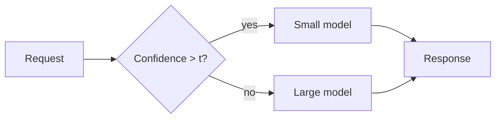

import Figure from '../../components/Figure.astro';
import Callout from '../../components/Callout.astro';
import chart from './_assets/example-chart.svg';

Ordinary prose with **bold**, _italic_, `inline code`, a
[external link](https://astro.build), and a footnote-free paragraph.

## A Mermaid diagram



## Maths

Inline $p(\text{escalate}) = 1 - \sigma(z)$ and display:

$$
\mathbb{E}[\text{cost}] = c_s + p \cdot c_l
$$

## A chart

<Figure src={chart} alt="Cost per resolved task against escalation threshold."
        caption="Fig. 1 — Exported from matplotlib as SVG." />

## A callout

<Callout type="warn">
  Numbers here are illustrative.
</Callout>

## Code

```python
def escalate(conf: float, t: float = 0.7) -> bool:
    return conf < t
```

## A table

| Route | Share | Cost |
| ----- | ----: | ---: |
| small | 82%   | 0.11 |
| large | 18%   | 0.94 |
